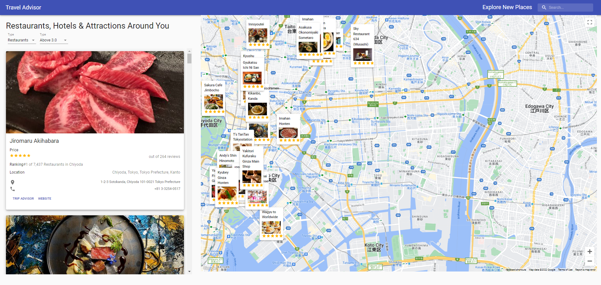
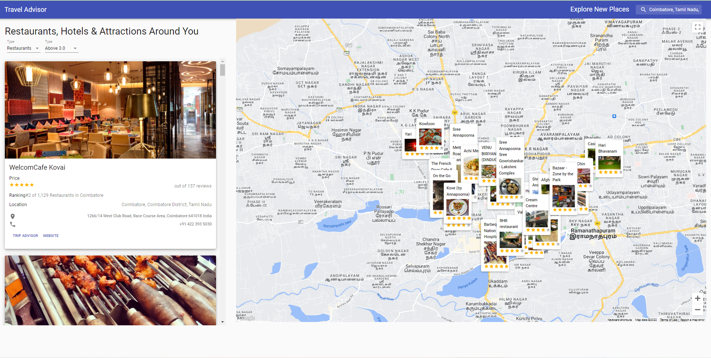

# Travel Advisor



### Concept Covered
- material-ui
- react google maps
- axios
- makestyles
- google map api
- rapid api(Travel Advisor)

### To Run this project in local 
- create a env file in src directory and add the corresponding api key

```
REACT_APP_GOOGLE_MAPS_API_KEY=place your api key
REACT_APP_RAPID_KEY=place your api key
```

